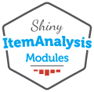

<!-- README.md is generated from README.Rmd. Please edit that file -->

# SIAtools 

> ‘ShinyItemAnalysis’ Modules Development Toolkit

<!-- badges: start -->

<!-- [](https://github.com/ApplStat/SIAtools/actions/workflows/R-CMD-check.yaml) -->

[](https://CRAN.R-project.org/package=SIAtools)
[](https://lifecycle.r-lib.org/articles/stages.html#experimental)

<!-- badges: end -->

A comprehensive suite of functions designed for constructing and
managing ‘ShinyItemAnalysis’ modules, supplemented with detailed guides,
ready-to-use templates, linters, and tests. This package allows
developers to seamlessly create and integrate one or more modules into
their existing packages or to start a new module project from scratch.

## Installation

Install the released version of SIAtools from CRAN with:

``` r
install.packages("SIAtools")
```

<div class="pkgdown-devel">

Or you can install the development version from our CRAN-like repository
with:

    install.packages("SIAtools", repos = c(
      "https://applstat.github.io/SIArepo/",
      "https://cloud.r-project.org/"
    ))

</div>

## Usage

Refer to `vignette("getting_started", "SIAtools")` to see how to use
`{SIAtools}`.
